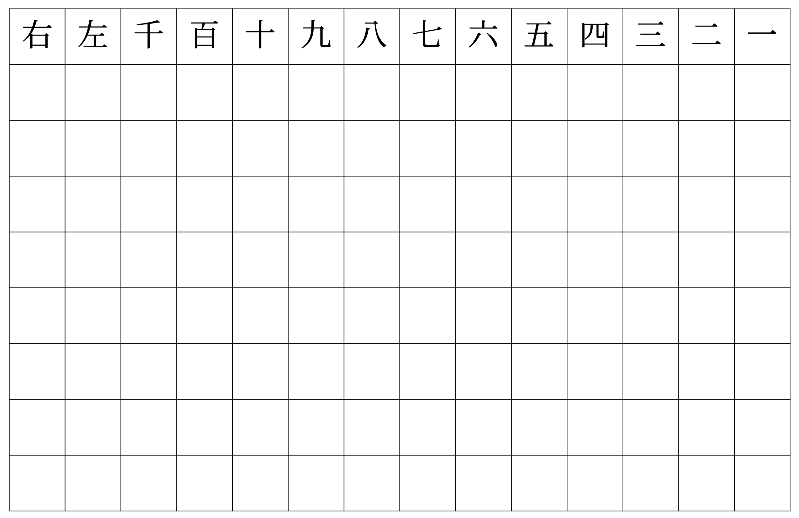

# Asian  Character Worksheet Generator



## Background
As an immigrant and father of two boys living in America, I want my sons to learn my language so that they can have the chance to learn more about their culture origin. I want to share with them the novels that I have read; the music that I have listened to and the movies that I have watched. To make it happens, it is essential to teach them how to write in my language.

At first I started making worksheet by using Google Doc. I had to create the layout manually (in grid format) and adjust the spacing. Then I had to type in character by character to each cell and readjust the spacing one by one. This project saves you time from the tedious manual effort of doing a copy and paste of a new worksheet. Also, this project automatically does all the work to adjust the column widths which is frankly not that enjoyable to do manually (Hey I want my beer time).

That's the reason for me to look into an automate way to get the job done.

## Benefits of Grid System
The grid system helps someone learning the language to write the characters in the proper size and orientation. The grid system gives a worksheet for the new learner to practice writing the characters.

## Requirements
1. [python3](https://www.python.org/downloads/)
2. [fpdf2](https://pypi.org/project/fpdf2/)

## How to Use
1. Edit the file `text` with the list of characters of your choice (or use the sample). Note that you need to supply 14 characters on each line.
```
一二三四五六七八九十百千左右
上大人孔乙己化三千七十士女小
生八九子佳作仁可知禮也你我他
父母兄弟上中下東南西北君親師
日月金木水火土天地海宇宙星宿
目耳鼻口眉手足舌皮心肌肝肺腸
あいうえおかきくけこアイウエ
일이삼사오육칠팔구십백천좌우
```
2. Generate the worksheet in pdf format with the following command:
```
pip install -r requirements.txt
python3 run.py
```
3. Print out the generated file `worksheet.pdf`

## Language Supported
1. Chinese
1. Japanese (Hiragana and Katagana)
1. Korean

## Sample
[sample worksheet](sample-worksheet.pdf)

## Code Overview
Everything is written in python in `run.py`. You can play with the font and gird size with the variables under the `# Basic settings` section. You can also try a different font to potentially make the generator works with a different language (eg. Korean Hangul).

## Contributing
Any suggestion will be appreciated. You can simply create a pull request with your idea. Feel free to fork the project too.

## Special Thanks
My lovely sons Tim and Hin. Also thanks TC Dan for giving valuable feedback to this README file. 
